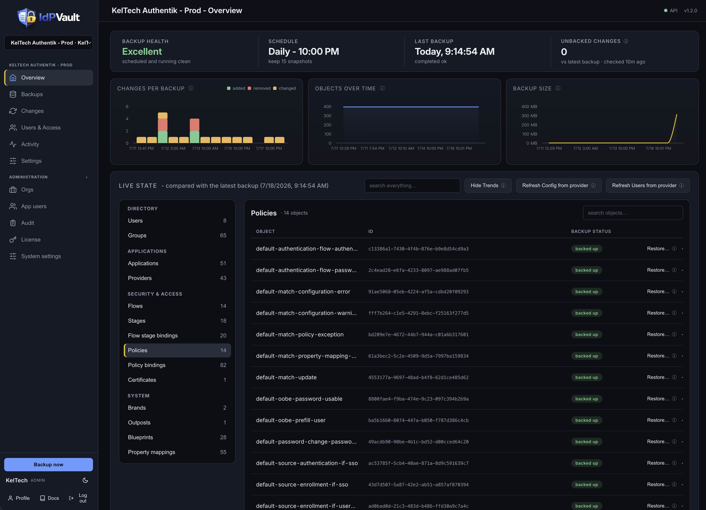

# IdPVault

[](https://github.com/KelTech-Services/IdPVault/actions/workflows/ci.yaml)
[](LICENSE)
[](https://github.com/KelTech-Services/IdPVault/pkgs/container/idpvault)
[](https://idpvault.com)

Self-hosted backup, drift detection, and restore for **Authentik**, **Okta**, and **Auth0** tenants.

Point IdPVault at your identity providers and it takes scheduled, encrypted snapshots of every
configuration object - apps, flows, policies, groups, mappings, and more. Browse snapshot history,
diff any two points in time, get alerted on config drift, and restore objects when something breaks.



## Features

- Scheduled + on-demand encrypted backups (AES-256-GCM, per-tenant envelope keys)
- Providers: Authentik, Okta, Auth0 (pluggable adapter interface)
- Users & Access backup (opt-in): users, group memberships, and provenance-aware app assignments
- Adaptive Okta rate limiting (auto-learns limits; configurable reserve headroom)
- Snapshot-to-snapshot diff, drift detection, and a per-object change events feed
- Restore engine: dry-run preview, dependency-ordered apply (Authentik), per-object
  restore reports
- Clone / promote: restore a snapshot into another same-provider tenant to push a
  perfected app from preprod to prod
- Multi-user: session login, admin / read-only roles, email invites, SMTP settings
- Dashboard: coverage, unbacked-changes (live IdP event polling), storage stats
- Snapshot object browser - inspect any object in any snapshot
- Retention policies per tenant; audit log with viewer
- Alerts on drift or failed backups: webhook (ntfy / Slack) + email
- Prometheus metrics endpoint (set IDPVAULT_METRICS_TOKEN to enable)
- Backups queue and run one at a time by default, safe for modest hosts (set
  IDPVAULT_BACKUP_WORKERS to run more in parallel); schedules run in your org
  timezone, DST-aware

## Quick deploy (Docker Compose / Portainer stack)

See `docker/compose.example.yaml`. Single app image + Postgres, no other
dependencies - and **zero configuration**: `docker compose up -d` is the whole
install. On first boot the app generates its master encryption key inside the
`idpvault_secrets` volume, fixes volume ownership, and drops to a non-root
user. **Back the key up right after first boot**
(`docker cp idpvault:/secrets/master.key ./master.key.backup`) - without it,
encrypted snapshots are unrecoverable, and there is no escrow or phone-home.
The app refuses to boot into either dangerous state (key missing with data
present, or a wrong key against an existing database) rather than corrupt
anything.

Named volumes are the default; to use host bind mounts instead, swap the
volume names for host paths in the stack - the app handles ownership itself.
The app runs as uid 10001 by default; set `PUID` and `PGID` in the stack
environment to run under your own user/group ids instead (the usual NAS
convention) - ownership fixes follow whichever ids you choose.
Setting `POSTGRES_PASSWORD` in the stack environment is recommended (the DB is
only reachable inside the stack's private network).

```yaml
services:
  idpvault:
    image: ghcr.io/keltech-services/idpvault:latest
    container_name: idpvault
    restart: unless-stopped
    ports:
      - "8480:8080"
    environment:
      IDPVAULT_DATABASE_URL: postgresql+psycopg://idpvault:${POSTGRES_PASSWORD:-idpvault-internal}@idpvault-db:5432/idpvault
      IDPVAULT_DATA_DIR: /data
      IDPVAULT_MASTER_KEY_FILE: /secrets/master.key
    volumes:
      - idpvault_data:/data
      - idpvault_secrets:/secrets
    depends_on:
      idpvault-db:
        condition: service_healthy

  idpvault-db:
    image: postgres:16-alpine
    container_name: idpvault-db
    restart: unless-stopped
    environment:
      POSTGRES_DB: idpvault
      POSTGRES_USER: idpvault
      POSTGRES_PASSWORD: ${POSTGRES_PASSWORD:-idpvault-internal}
    volumes:
      - idpvault_postgres:/var/lib/postgresql/data
    healthcheck:
      test: ["CMD-SHELL", "pg_isready -U idpvault"]
      interval: 10s
      timeout: 5s
      retries: 5

volumes:
  idpvault_data:
  idpvault_secrets:
  idpvault_postgres:
```

## Platform support (Linux, macOS, Windows)

IdPVault runs anywhere Docker runs. The image is published for **linux/amd64 and
linux/arm64** as a single tag, so `docker compose up` pulls the right build
automatically - no per-platform compose files, the stack above works unchanged on
every platform.

- **Linux servers and NAS boxes** (Debian/Ubuntu/RHEL, Synology, QNAP, Unraid,
  TrueNAS, Proxmox): the primary target. Works with Docker Engine or Portainer.
  On Synology/QNAP, install Docker/Container Manager from the package center and
  paste the stack into Portainer or a compose project.
- **macOS** (Docker Desktop, OrbStack, or Colima): works on both Intel and Apple
  Silicon - Apple Silicon gets the native arm64 image. Fine for evaluation and
  small setups; for always-on production use a server, since a sleeping laptop
  means missed backup schedules.
- **Windows** (Docker Desktop with the WSL2 backend, the default on Windows
  10/11): works out of the box. Keep the default named volumes; if you switch to
  bind mounts, put them on the Linux side of WSL2 (not a `C:\` path) for correct
  permissions and much better performance.
- **ARM boards** (Raspberry Pi 4/5 and other arm64 SBCs): supported via the
  arm64 image. 64-bit OS required; 2 GB+ RAM recommended.

Notes that apply everywhere: the app listens on port 8080 inside the container
(remap the host side freely if 8480 is taken); data lives in the three named
volumes, so `docker compose down` never loses anything; back up the
`idpvault_secrets` volume (master key) and `idpvault_postgres` with your host
backup tool; put a reverse proxy with HTTPS in front for anything beyond
localhost (see the Deployment doc in-app or on the wiki).

## Support & contact

Bugs, feature requests, and questions: [open a GitHub issue](https://github.com/KelTech-Services/IdPVault/issues/new/choose).
Security reports: privately only, per [SECURITY.md](SECURITY.md).

## Repo layout

- `backend/` - FastAPI application
- `frontend/` - web UI (single-file SPA) + in-app docs
- `docker/` - Dockerfile, example compose stack, env template
- `docs/` - architecture and operations notes
- `.github/workflows/` - CI: tests gate the image build; releases auto-publish

## Status

v1.0 shipped. See `CHANGELOG.md` for the full version history and `docs/ROADMAP.md` for shipped versions and what's next.

## What a backup contains - and what it doesn't

IdPVault backs up your IdP's **configuration** via its API: applications, providers, flows,
stages, policies, groups, property mappings, and the rest of the objects listed per provider.
Snapshots are encrypted, versioned, and diffable, and support selective config restore.

**This is not a full disaster-recovery backup.** Two things to understand before you rely on it:

1. **Secrets are redacted by the IdP, not by us.** Identity providers deliberately never return
   OAuth2 client secrets, certificate private keys, SMTP passwords, or signing keys through
   their export/read APIs. A restored object may therefore come back with its secret missing -
   you will need to re-enter or rotate those secrets after a restore. This is true of every
   backup product in this space, for Okta and Auth0 as much as Authentik.

2. **Self-hosted IdPs have state outside the API.** For self-hosted Authentik, a true
   bare-metal recovery additionally needs, backed up by your own infrastructure tooling:
   - a `pg_dump` of the Authentik Postgres database (the actual source of truth),
   - its bind mounts (`/data`, `/certs`, `/custom-templates`, `/media`),
   - the compose file / environment, especially `AUTHENTIK_SECRET_KEY` - without the same
     secret key, a restored database cannot decrypt the secrets it holds.

   IdPVault's Full-DR mode covers the first of these: give a self-hosted Authentik
   tenant its Postgres URL and an encrypted `pg_dump` is captured alongside config
   snapshots on every backup.

Use IdPVault for what it is: configuration versioning, drift detection, and config-level
restore. Pair it with host-level backups of your self-hosted IdP for full disaster recovery.


## Licensing & tiers

IdPVault is source-available under the **Business Source License 1.1** (see
`LICENSE`): you can run it in production for your own organization; offering it
to third parties as a hosted/managed service requires a commercial agreement.
The code converts to Apache 2.0 on the Change Date.

The app itself is open-core:

- **Community (free, no key needed):** 1 tenant, full config backup, drift
  detection & events, alerts, and config restore.
- **Business:** 2 tenants (with tenant add-ons available), unlimited users, and
  Users & Access backup & restore (users, group memberships, app assignments).
- **MSP:** everything in Business plus client orgs, org-scoped users, and renewal
  tracking. Tenant add-ons whenever you need them.

Flat, published pricing at https://idpvault.com.

License keys are Ed25519-signed tokens verified **entirely offline** against a
public key embedded in the app - IdPVault never phones home and sends no
telemetry. Install/manage keys in **Settings → License**. If a license expires
(after a 3-day grace window) or is removed, nothing is deleted: your oldest
tenant stays fully operational, other tenants keep all their data and snapshots
but pause backup/restore, and identity features pause - everything resumes as
soon as a valid key is installed. Renewal keys can be installed early; their
term extends from the previous expiry.
